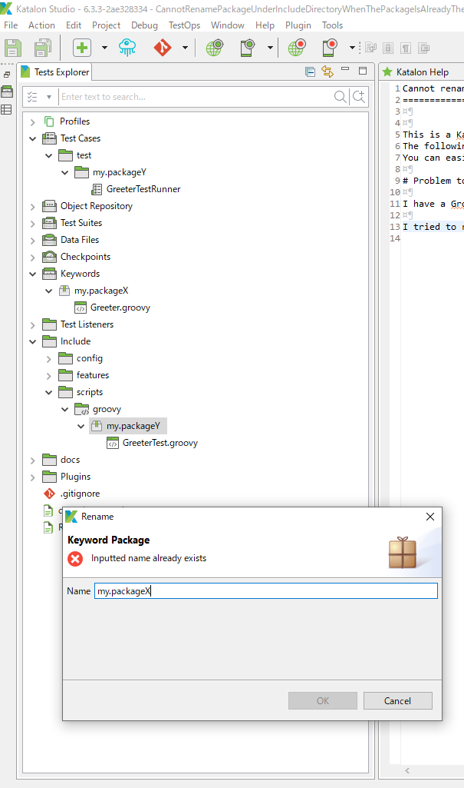

Cannot rename package under Include directory when the package is already there under Keywords directory
==============================

This is a Katalon Studio project to demonstrate a defect found in the Katalon Studio v6.3.3 and possible in the older versions as well.
The following description is based on the files/directories contained in this project. You can clone this project out from GitHub.
You can easily reproduce the problem.

# Problem to solve

I use JUnit inside Katalon Studio to do unit-testing over custom keywords as I described at [another post](https://forum.katalon.com/t/junit4-katalon-studio-integration-by-a-built-in-keyword/17637/5).
During that exercise, I often need to rename Groovy packages.

In the sample project, I have a file `Include/scripts/groovy/my.packageY/GreeterTest.groovy`, and wanted to move it to `Included/scripts/groovy/my.packageX/GreeterTest.groovy`.

I tried renaming it with Katalon Studio's UI. In the Test Explorer, select the `Include/scripts/groovy/my.packageY` and mouse-right-click to choose `Rename` to `my.packageX`.
Then the dialog rejected renaming with message `Inputted package is already exists`.

In the `Include/scripts/groovy` directory there is NOT a package `my.packageX`. Therefore, no reason why I can not rename `my.packageY` to `my.packageX`.

# Reason why KS behaves as such

In the `Keywords` directory there is a package `my.packageX`.
This seems to be the reason why KS rejects my request.
KS checks duplication of package names in the Keywords directory and the Include/script/groovy directory.

# What's funny

It was funny to find that I could add `my.packageX` under the `Include/scripts/groovy` directory while KS rejects renaming `my.packageY` to `my.packageX`.

# How significant is it?

I often do refactoring of package names for code clarity. This restriction (I can not rename packages under Include/scripts/groovy) makes the refactoring difficult.
This gives me an impression that KS being unprofessional.
